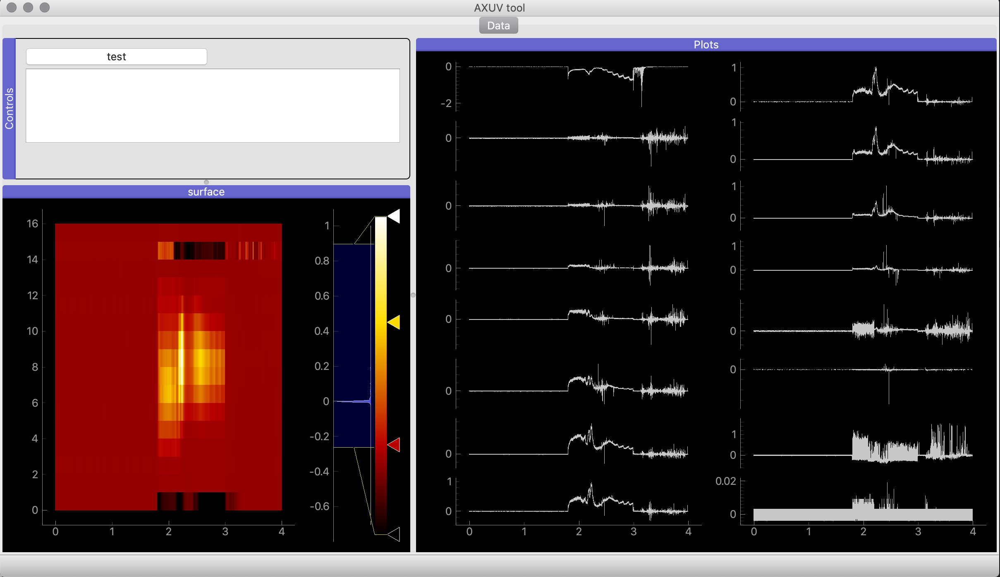

# AXUV analysis tool.


`$ pyton3 main.py` to start the tool.





# Requirements

```
- pyqtgraph
- numpy
- matplotlib
- pandas
```

`pyqtgraph` requires either `pyqt5` or `pyside`. To install pyqt5 on linux, use `apt-get`:

```py
sudo apt-get update
sudo apt-get install qt5-default pyqt5-dev pyqt5-dev-tools
```

On **Win** and **OS X**  `pyqt5` is now available from `pip`.